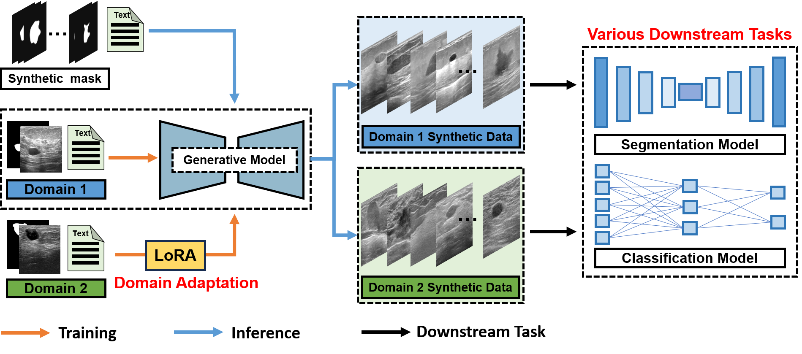
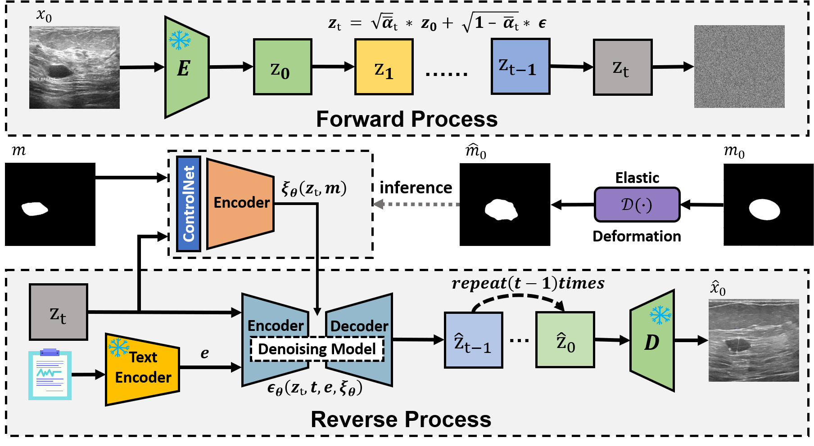

# Clinical Prior Guide Tumor Generation
This repository contains the official implementation of the paper:

"Clinical Guided Tumor Generation for Breast Ultrasound with Cross Domain Adaptation"
Accepted at MICCAI 2025 [[MICCAI2025]]

# Overview of Framework

# Training Pipeline

